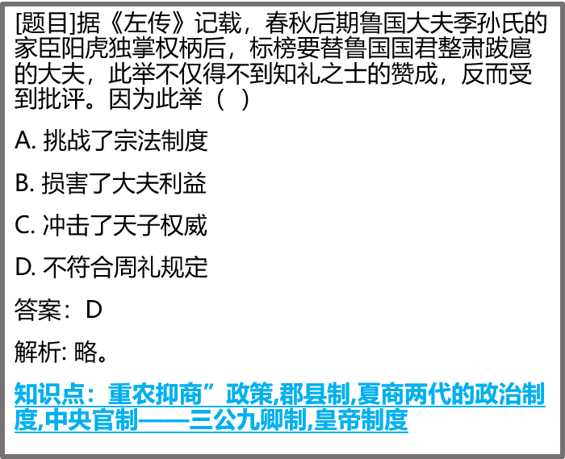
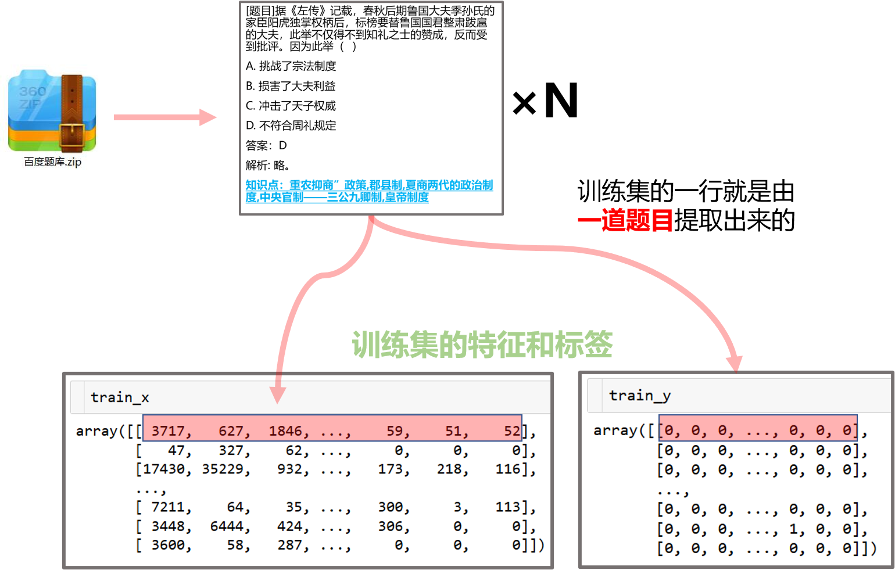
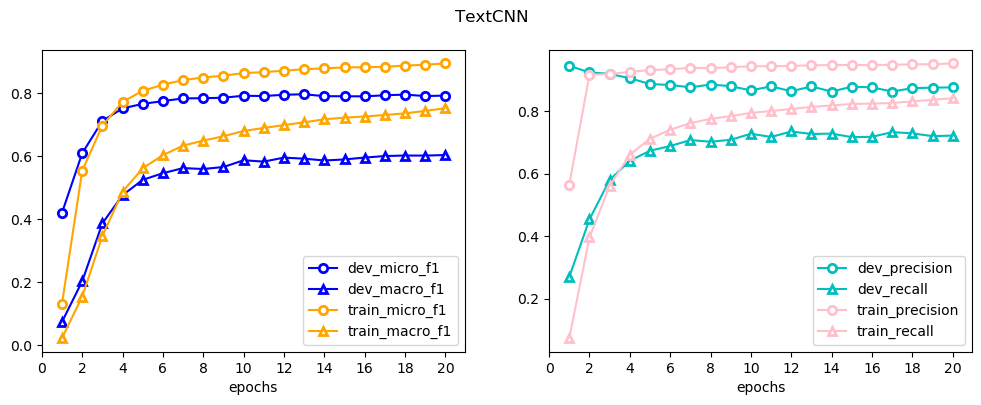
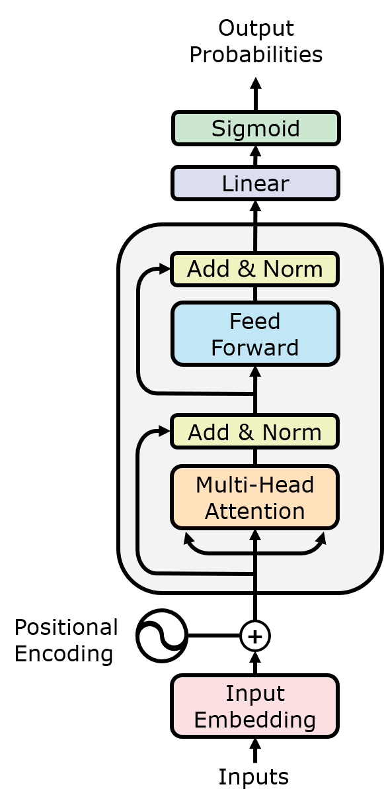
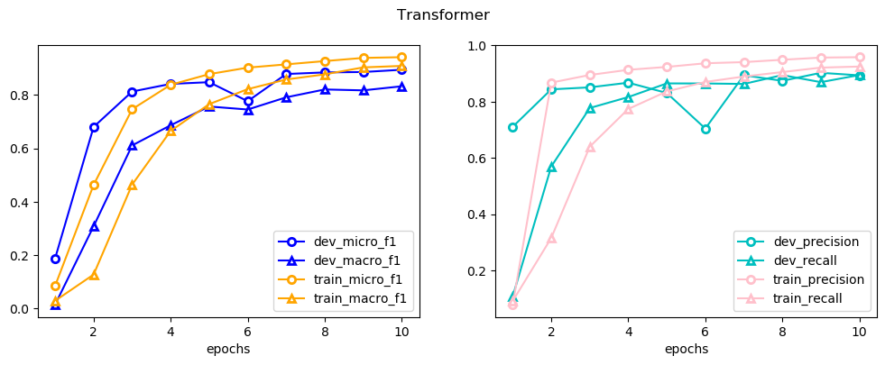
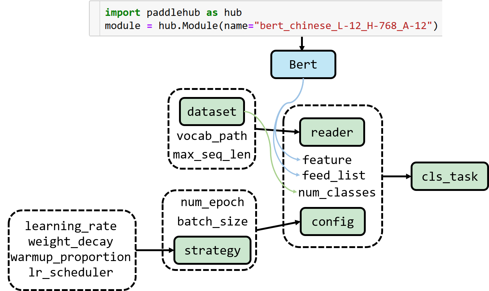

# Text-Classification

这个项目的任务是**试题知识点标注**。

我使用了3个深度学习模型做这个项目，分别是TextCNN， Transformer, Bert。这个项目属于学习型项目，主要是通过代码实践的方式，加深对理论的理解。模型的性能拉到最下面，下面具体介绍项目：

这是一个多标签分类任务，数据集包含高中4个科目的题目，每门科目下又有不同的主题。如：**历史-古代史(1000)** 括号内的数字表示这个主题有1000道题目，总共有29000多道题目。同时，每道题目有许多知识点，比如古代史的第一题是这样的：

**结尾部分**会有知识点，所以在数据预处理的时候还需要为每道题目提取出知识点。项目的大致流程如下：

# 数据预处理

首先开局一个[压缩包](data/百度题库.zip)，~~代码全靠copy~~

先进行数据预处理，代码在[preprocess.py](utils/preprocess.py)。数据预处理的代码详解可以看[数据预处理.ipynb](notebook/数据预处理/数据预处理.ipynb)。里边有非常详细的步骤。

经过数据预处理后得到了这三个模型能用的数据。对于**bert**是整理出：

- `train.tsv`
- `dev.tsv`
- `test.tsv`

对于**Transformer**和**TextCNN**是整理出

- `x.npy`
- `y.npy`

我是按照频率筛标签的，总共提取出来900多个标签，但有些标签只出现了十几次甚至一两次，于是我删除了出现次数低于样本总数 1%的标签。最后剩下97个标签。

上面处理得到的文件的区别是对于bert，此时的tsv文件中的文本还是字符，而且没有去停用词等操作，因为像这种预训练模型比如bert，它是由大量文本训练出来的，本身对特征提取的能力比较强，所以文本预处理不像传统机器学习模型那样要求那么多，比如bert就可以不剔除标点符号；而且bert本身自带了tokenize的函数，我们只需要把文本按照tsv格式分好即可。

而对于Transformer和TextCNN数据预处理后的文件已经变成Token了。

# TextCNN

先来感性认识一下模型的输入：

在上一步textcnn预处理完成后，生成的训练集如下图。`train_x`是句子的token，`train_y`是标签。一行表示一道题目，句子和标签均是由一道题目提取出来的。

TextCNN模型我是基于一个keras的实现，参考着【[模型类方式编写线性回归](https://tf.wiki/zh/basic/models.html)】这个案例来写的。所以我的TextCNN模型比较类似于[谷歌Transformer](https://tensorflow.google.cn/tutorials/text/transformer?hl=en)的编写方式。编写代码在: [TextCNN学习.ipynb](notebook\TextCNN\TextCNN学习.ipynb)

可以自定义kernel_size 大小各不相同的1维卷积层。主要对标上面这幅图，我实现的模型跟上面这张图类似。但是不是2分类模型而是多标签分类。

模型代码：[model.py](textcnn/model.py)详细的TextCNN代码解释请看[TextCNN运用.ipynb](notebook\TextCNN\TextCNN运用.ipynb)。TextCNN的训练过程如下：

召回率在12轮左右基本固定在0.7左右，macro-f1score大概在0.58左右。我认为这个多标签文本分类任务看中的主要是**召回率**跟**macro-f1score**。召回率越高表示越能提取试题中的知识点。而macro-f1socre越高表示各个知识点的分类效果都不错，因为这个数据集标签不平衡的现象还是蛮严重的，有的标签有上千个样本，而有的标签只有几百个。可以看到TextCNN的性能不能说很让人满意。

# Transformer

对于使用tensorflow的用户来说，学transformer真的是非常方便，[官网教程](https://tensorflow.google.cn/tutorials/text/transformer)上直接有2.0的教程。

我的notebook里也有[Transormer学习.ipynb](notebook\Transformer\Transformer学习.ipynb)，从官网改过来的比官网教程稍微详细点，但没有用到官网的数据集。

文本分类任务里，**没有**用到Decoder的部分，而是Encoder最后的输出接一个激活函数为sigmoid的全连接层输出概率。如图：

Transformer的训练过程如下，源码：[model.py](transformer/model.py)。详细代码解释[Transformer运用.ipynb](notebook\Transformer\Transformer运用.ipynb)：

Transformer的性能就明显优于TextCNN了，只需要迭代不到十轮效果就高于TextCNN了。

最后验证集的recall大约为0.8左右，macro-f1score大概在0.75左右

# BERT

在[bert源码探索](notebook/BERT/bert源码探索.ipynb)里我详细探讨了如何修改bert关键的`run_classifier.py`文件，主要是怎么修改数据处理的接口，使得我们的任务能用得上bert，以及评估指标，损失函数的修改。但我说实话这真是太麻烦了，而且只能使用tensorflow1的静态图版本。

所以建议使用百度PaddlePaddle的PaddleHub，上面集成了很多预训练模型，加载模型只用2两行代码。开始预训练任务（除了数据预处理）总共不超过20行代码。

- [PaddleHub官网](https://www.paddlepaddle.org.cn/hub)

- [PaddleHub Github]()

我在用PaddleHub完成这个项目的时候，参考的主要例子是这个[PaddleHub 多标签分类](https://github.com/PaddlePaddle/PaddleHub/tree/release/v1.6/demo/multi_label_classification) 。可以在百度AI Studio使用，我把我这个项目的工程也放到了“[paddlehub实现bert](notebook/BERT/paddlehub实现bert.ipynb)”里了。

用paddle实现多分类的流程大致如下：

虚线框表示是参数，实线框框起来的是一个对象。最后是通过`cls_task.finetune_and_eval()`执行训练任务的。

类似Tensorflow的bert，你也需要写一个数据预处理的类来产生`dataset`。具体请看[paddlehub实现bert](notebook/BERT/paddlehub实现bert.ipynb)

bert这里我还没研究怎么画出训练过程的图，paddlehub教程说是可以用tensorboard，但是我本机性能不高，主要是在ai studio上跑的项目，所以没能可视化bert的训练过程。

# 模型评估

| 模型                                 | micro f1 | macro f1 | precision | recall |
| ------------------------------------ | -------- | -------- | --------- | ------ |
| TextCNN                              | 0.7834   | 0.5831   | 0.8640    | 0.7166 |
| Transformer                          | 0.8858   | 0.8200   | 0.8860    | 0.8857 |
| bert_wwm_ext_chinese_L-12_H-768_A-12 | 0.9102   | 0.9066   | 0.9257    | 0.8953 |

