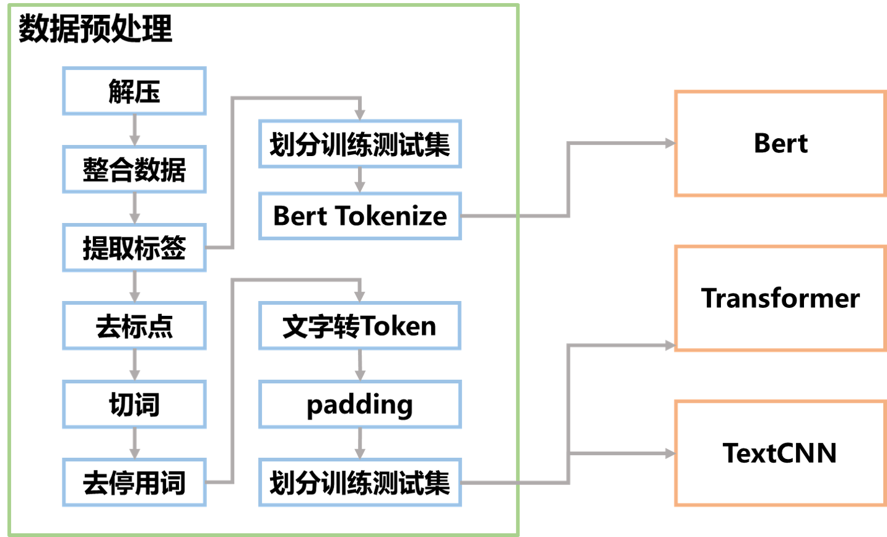

# Text-Classification

项目流程如下：

开局一个压缩包，~~代码全靠copy~~

首先是数据预处理，代码在`utils/preprocess.py`。数据预处理的详解可以看`notebook/数据预处理`

总之经过数据预处理后得到了这三个模型能用的数据。对于**bert**是整理出`train.tsv`，`dev.tsv`，`test.tsv`三个文件。对于**Transformer**和**TextCNN**是整理出`train.csv`,`dev.csv`,`test.csv`

两者的区别是对于bert，数据预处理后的文本还是中文，而且没有去停用词等操作。而对于Transformer和TextCNN数据预处理后的文本已经变成数字了。